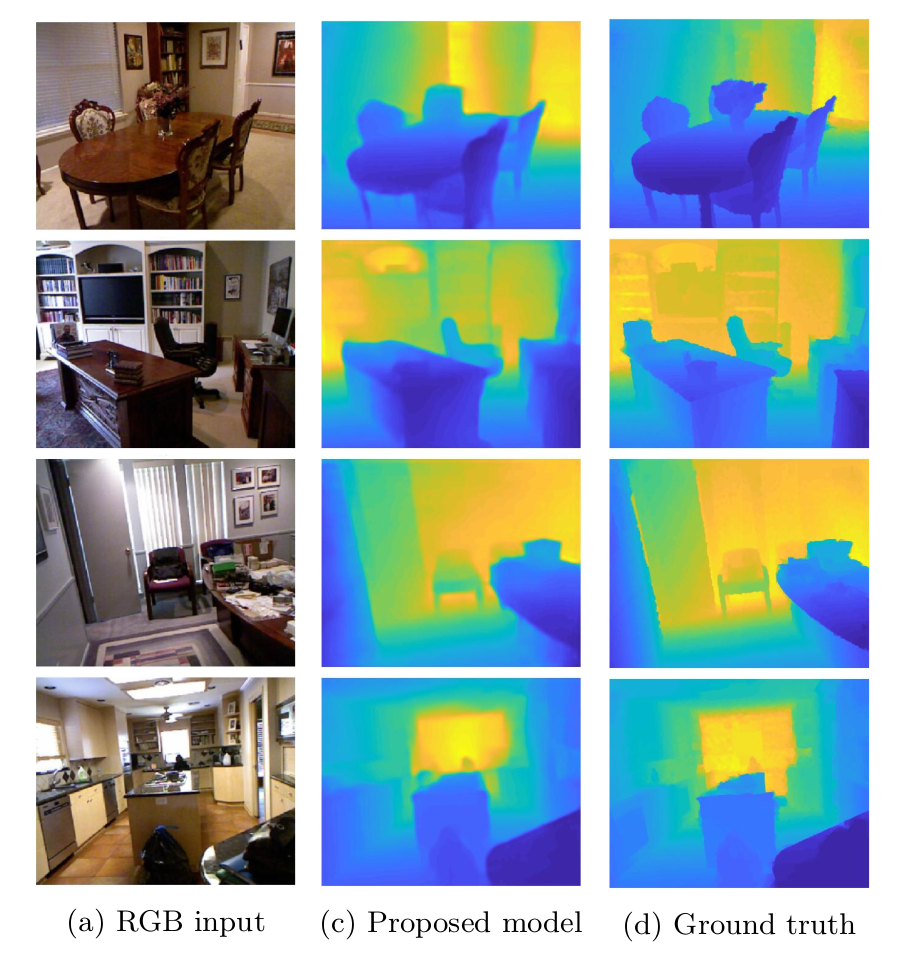

Hybrid CNN for Single Image Depth Estimation
============================================
This repository contains a CNN trained for single image depth estimation. The backbone of the architecture is the network from [Laina et. al](https://arxiv.org/abs/1606.00373), which we enhanced with Unet-like lateral connections to increase its accuracy. The network is trained on the [NYU Depth v2 dataset](https://cs.nyu.edu/~silberman/datasets/nyu_depth_v2.html). The repository also contains the code snippet we used for evaluation on test set of the NYU Depth v2 dataset, the test set itself (654 RGB images with their corresponding depth maps), and two short scripts for predicting the depth of RGB images and videos.


### Paper Describing the Approach
[Károly Harsányi, Attila Kiss, András Majdik, Tamás Szirányi: 
A Hybrid CNN Approach for Single Image Depth Estimation: A Case Study.](https://link.springer.com/chapter/10.1007%2F978-3-319-98678-4_38)
IWCIM - 6th International Workshop on Computational Intelligence for Multimedia Understanding, 2018

### Requirements
The code was tested with:
- python 3.5 and 3.6
- pytorch (and torchvision) 1.3.0
- opencv-python 3.4.3
- matplotlib 2.2.3
- numpy 1.15.4


### Guide
- Evaluation on the NYU_depth_v2 test set:
```
python3 compute_errors.py
```
- Predicting the depth of an arbitrary image:
```
python3 predict_img.py -i <path_to_image> -o <path_to_output>
```
- Predicting the depth from a video:
```
python3 predict_vid.py -i <path_to_input_video> -o <path_to_output_avi>
```

### Evalutation
- Quantitative results:
 
| REL  |  RMSE  | Log10 |  δ1 |  δ2 |  δ3 |
|:-----:|:-----:|:-----:|:-----:|:-----:|:-----:|
| 0.130 | 0.593 | 0.057 |0.833 |0.960 |0.989 |

- Qualitative results:



### Acknowledgments
Most of the code for the ResNet50 architecture comes from [pytorch/vision](https://github.com/pytorch/vision/blob/master/torchvision/models/resnet.py), and a few lines of code were borrowed from [FCRN-DepthPrediction](https://github.com/iro-cp/FCRN-DepthPrediction).

### About the training code
Lots of people reached out to me about the training code. Sadly, I stopped working on this project a long time ago. I don't have access to the same data and codebase anymore, so can't share the training code. However, the work is based on this paper: https://link.springer.com/chapter/10.1007%2F978-3-319-98678-4_38, which describes the training process in detail, and the depth dataset is available for researchers and students. If anyone is willing to invest time into writing the training code for themselves, I am happy to help.